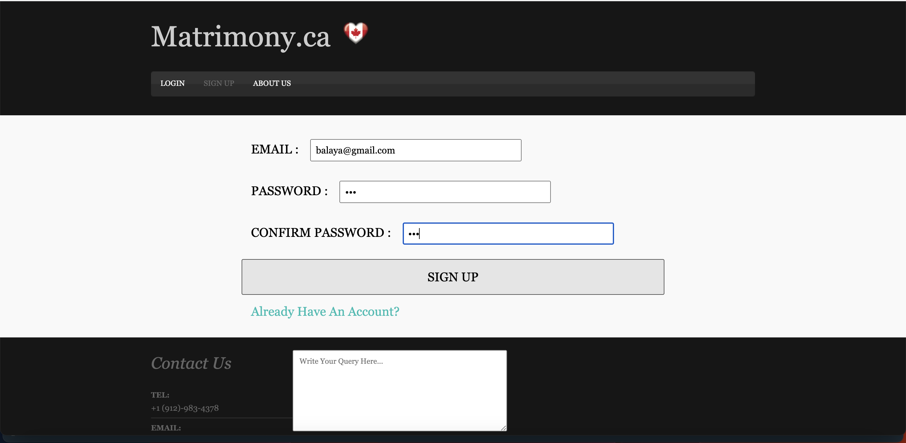
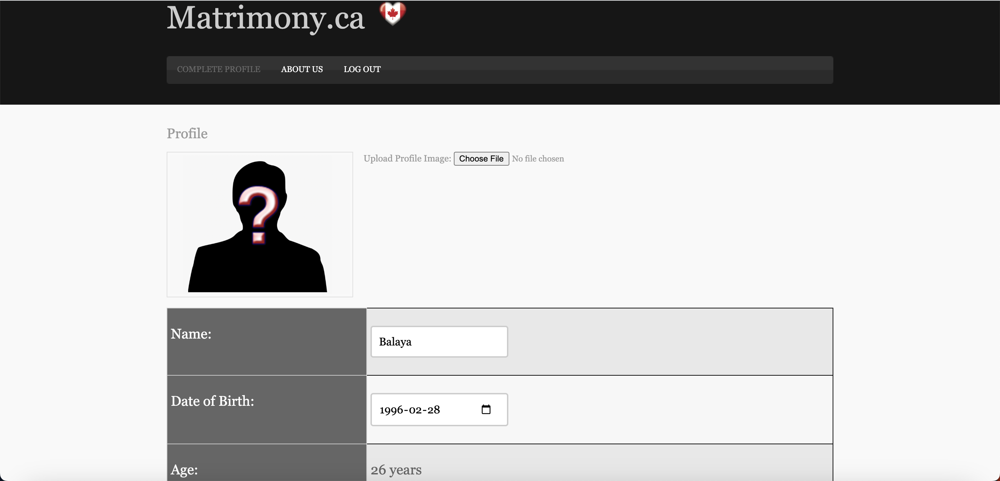
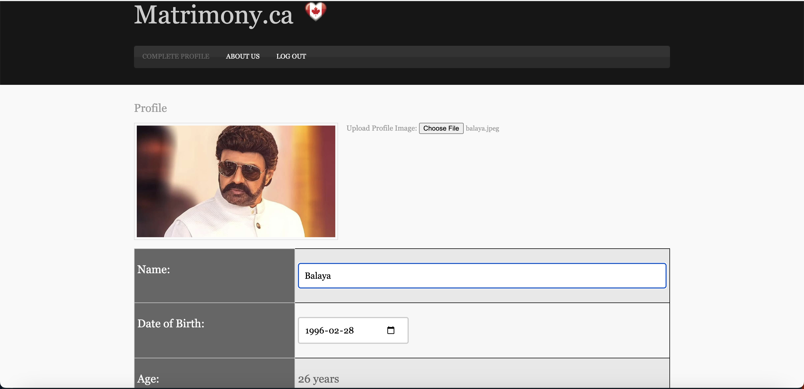
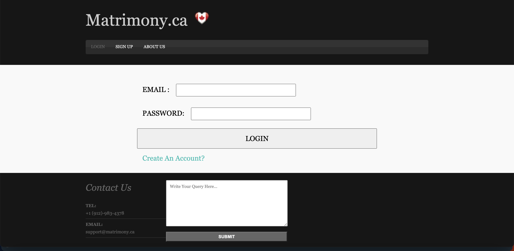
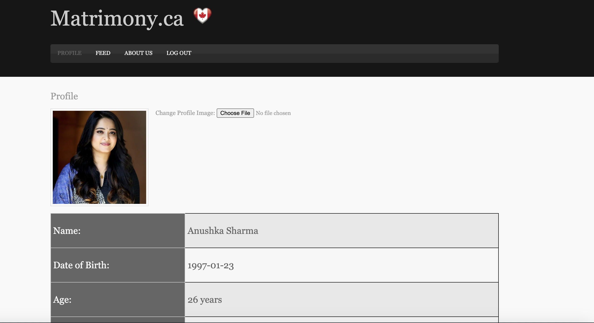
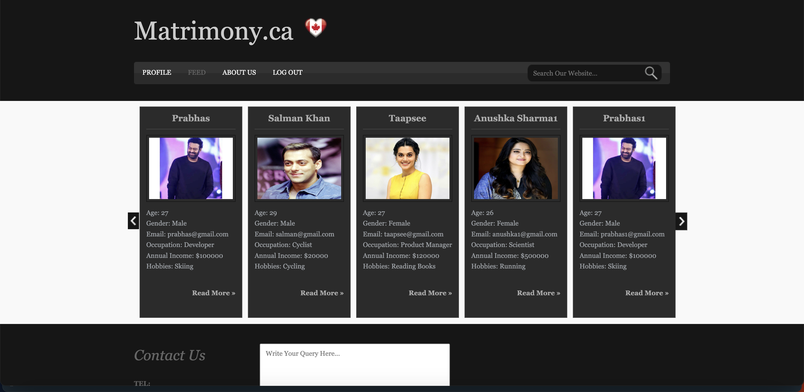
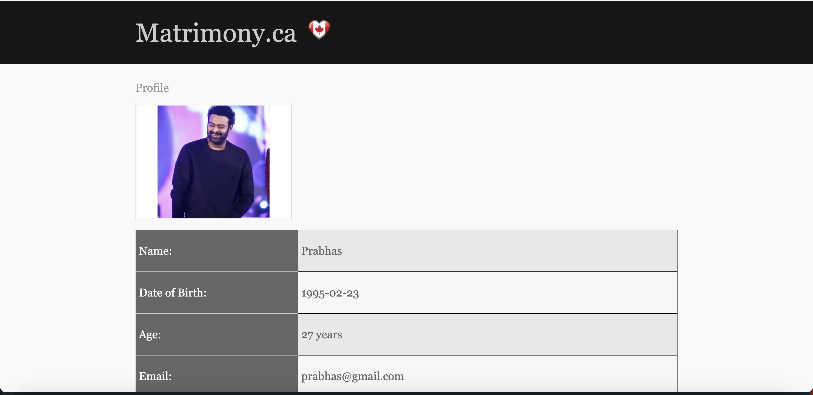

# Matrimony.ca (UI only)
Pure JS/JQuery web application application uses XML and LocalStorage as a mock of Database.

### Create Profile

### Complete Profile

### User Adding Profile image

### Login Page

### User Profile Page

### Feed

### Other's Profile Page

